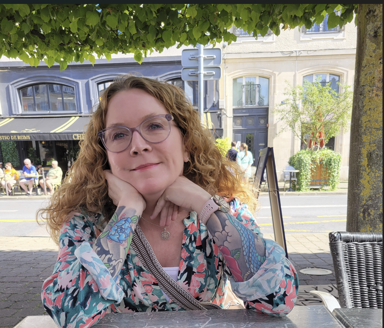

# About me

Music runs through my veins—whether it's the raw energy of punk, the intricate rhythms of jazz, the crushing riffs of metal, or the introspective vibes of indie, I’m always chasing that perfect soundtrack. My love for music is matched only by my passion for words. With a Master’s Degree in English, I’ve spent years diving into the depths of literature, where I’ve found inspiration, solace, and occasionally a bit of existential dread.

Originally from the U.S., I made the leap across the pond to Stockholm, Sweden, in 2017. It’s been a wild ride embracing the Scandinavian way of life, but it’s also where I’ve raised my greatest work of art—my kid, named after the brilliant Samuel Beckett (because what’s a little absurdism in parenting, right?).

I’ve always been drawn to tattoos as a form of self-expression, and over the years, I’ve collected a few that mean the world to me—including two full sleeves that tell my story in ink. As a kid, I dreamt of being a professional tennis player, but life had other plans. These days, you’re more likely to find me traveling the world, seeking out the next great restaurant, or catching a live gig that makes it all worthwhile. Whether diving into a new book or exploring a new city, I’m always looking for the next adventure.

<figure><figcaption></figcaption></figure>



* <mark style="color:purple;">Tool</mark>
* <mark style="color:purple;">Radiohead</mark>
* <mark style="color:purple;">The Smile</mark>
* <mark style="color:purple;">Elliott Smith</mark>
* <mark style="color:purple;">Jeff Buckley</mark>



* <mark style="color:purple;">Requiem for a Dream</mark>
* <mark style="color:purple;">Kinds of Kindness</mark>
* <mark style="color:purple;">The Grand Budapest Hotel</mark>
* <mark style="color:purple;">Hereditary</mark>
* <mark style="color:purple;">The Hours</mark>


