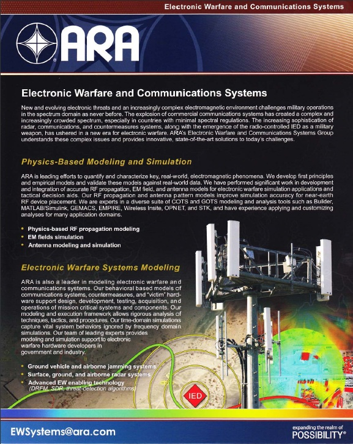
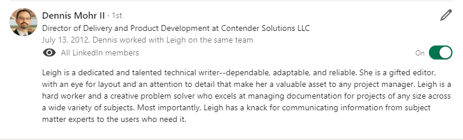
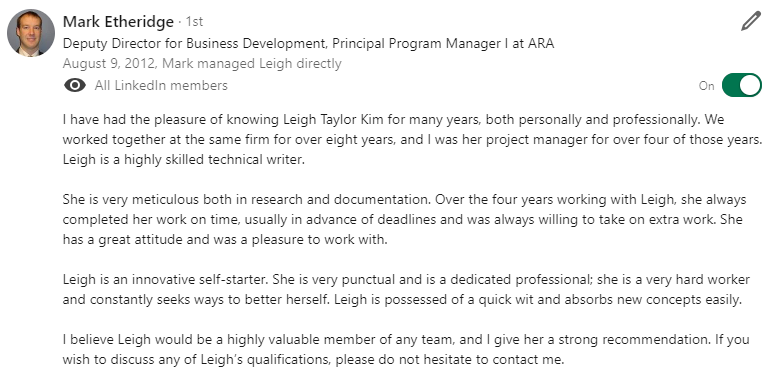
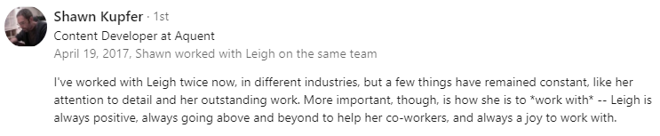

# Portfolio

## Hey there, welcome to my portfolio!

I’m Leigh Hutchens, your go-to for all things product enablement and content creation. This portfolio is a peek into the projects I’ve tackled, from leading teams to whipping up world-class documentation. I’m all about turning complex ideas into clear, user-friendly content that hits the mark every time. Take a look around and see what I’ve been up to!

<figure><figcaption>
Applied Research Associates
</figcaption></figure>







<figure><figcaption></figcaption></figure>

<figure><figcaption></figcaption></figure>

<figure><figcaption></figcaption></figure>
